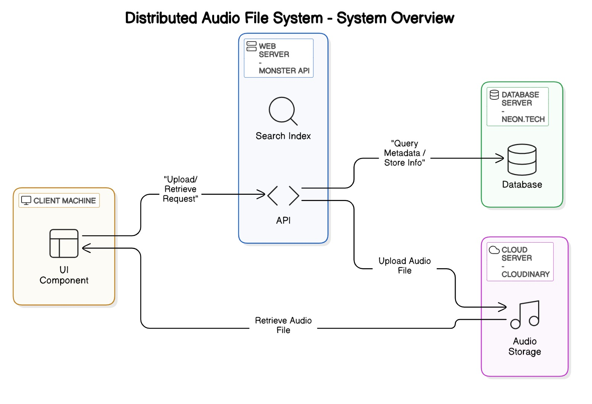

# Audio Search and Retrieval System

<div align="center">


</div>

## 📑 Table of Contents 
  - [System Overview](#system-overview)
    - [Architecture Components](#architecture-components)
      - [Client Machine](#client-machine)
      - [Web Server (Monster API)](#web-server-monster-api)
      - [Database Server (NEON.TECH)](#database-server-neontech)
      - [Cloud Server (CLOUDINARY)](#cloud-server-cloudinary)
    - [System Interactions](#system-interactions)
  - [Live Demo](#live-demo)
  - [Team Members](#team-members)
  - [Features](#features)
  - [Technology Stack](#technology-stack)
    - [Frontend](#frontend)
    - [Backend](#backend)
  - [API Documentation](#api-documentation)
    - [Audio Endpoints](#audio-endpoints)
    - [Category Endpoints](#category-endpoints)
    - [Search Endpoints](#search-endpoints)
  - [Getting Started](#getting-started)
    - [Prerequisites](#prerequisites)
    - [Installation](#installation)
  - [Project Structure](#project-structure)
  - [Contributing](#contributing)
  - [Acknowledgments](#acknowledgments)

## System Overview



The Distributed Audio File System is a comprehensive solution for storing, retrieving, and searching audio files with advanced metadata capabilities. The system consists of several interconnected components working together to provide a seamless user experience.

### Architecture Components

#### Client Machine
- **UI Component**: The frontend interface built with React, TailwindCSS, and TypeScript
- Handles user interactions, audio playback, and displays search results
- Communicates with the backend API for all data operations

#### Web Server (Monster API)
- **API**: RESTful API service handling all client requests
- **Search Index**: Provides fast and efficient search capabilities for audio content and metadata

#### Database Server (NEON.TECH)
- Stores all metadata related to audio files
- Manages categories, tags, and user information
- Provides structured data storage for the application

#### Cloud Server (CLOUDINARY)
- **Audio Storage**: Dedicated cloud storage for audio files
- Optimized for streaming audio content
- Handles file uploads and retrieval operations

### System Interactions

1. **Upload/Retrieve Request**: Client initiates requests to the API for file operations
2. **Query Metadata/Store Info**: The API communicates with the database to store or retrieve metadata
3. **Upload Audio File**: Audio files are sent to Cloudinary for secure storage
4. **Retrieve Audio File**: Audio content is streamed from Cloudinary to the client


## Live Demo 

> ⚠️ **Note**: Currently, the live demo APIs are experiencing issues. While we work on resolving this, you can:
> - [Run the project locally](#getting-started) to explore all features
> - [Contribute](#contributing) if you have a solution to improve API stability


Experience the application live at: [https://audio-retrival.vercel.app/](https://audio-retrival.vercel.app/)

## Team Members

<div align="center">
  <table>
    <tr>
      <td align="center">
        <a href="https://github.com/Ahmed-AbdullahCreates">
          <br />
          <sub><b>Ahmed Abdullah</b></sub>
        </a>
      </td> 
      <td align="center">
        <a href="https://github.com/Elghrabawy">
          <br />
          <sub><b>Ibrahim Alghrbawy</b></sub>
        </a>
      </td>
      <td align="center">
        <a href="https://github.com/Ahmed010Ashraf">
          <br />
          <sub><b>Ahmed Ashraf</b></sub>
        </a>
      </td>
      <td align="center">
        <a href="https://github.com/AhmedAyman4">
          <br />
          <sub><b>Ahmed Ayman</b></sub>
        </a>
      </td>
      <td align="center">
        <a href="https://github.com/MohamedOmaraa">
          <br />
          <sub><b>Mohamed Omara</b></sub>
        </a>
      </td>
    </tr>
  </table>
</div>


## Features

- **Audio File Management**: Upload, organize, and retrieve audio files
- **Advanced Search**: Search by title, category, tags, and other metadata
- **Categories and Tags**: Organize audio files with a robust categorization system
- **Audio Playback**: Built-in audio player with playback controls
- **Transcription**: Audio transcription capabilities for enhanced searchability
- **Responsive Design**: Works seamlessly across different devices and screen sizes

## Technology Stack

### Frontend
- **React 18**: Modern UI library for building component-based interfaces
- **TypeScript**: For type-safe code and better developer experience
- **TailwindCSS**: Utility-first CSS framework for rapid UI development
- **React Router**: For seamless navigation and routing
- **Zustand**: Lightweight state management solution
- **Vite**: Next-generation frontend tooling for faster development

### Backend
- **RESTful API**: Well-structured endpoints for CRUD operations
- **Database**: PostgreSQL hosted on NEON.TECH for reliable data storage
- **Cloud Storage**: Cloudinary for optimized audio file storage and delivery
- **Search Indexing**: For fast and efficient content retrieval

## API Documentation 

### Audio Endpoints

| Endpoint | Method | Description | Parameters |
|----------|--------|-------------|------------|
| `/api/audio` | GET | Get all audio files | `category`, `tag`, `search` |
| `/api/audio/:id` | GET | Get audio by ID | - |
| `/api/audio` | POST | Upload new audio | `file`, `metadata` |
| `/api/audio/:id` | PUT | Update audio metadata | `metadata` |
| `/api/audio/:id` | DELETE | Delete audio | - |

### Category Endpoints

| Endpoint | Method | Description | Parameters |
|----------|--------|-------------|------------|
| `/api/categories` | GET | Get all categories | - |
| `/api/categories/:id` | GET | Get category by ID | - |

### Search Endpoints

| Endpoint | Method | Description | Parameters |
|----------|--------|-------------|------------|
| `/api/search` | GET | Search for audio | `query`, `filters` |

For detailed API implementation and backend source code, visit our [Audio Retrieval API Repository](https://github.com/Elghrabawy/Audio_Retrieval_API).

## Getting Started

### Prerequisites
- Node.js (v18 or later)
- npm or yarn package manager

### Installation

1. Clone the repository
```bash
git clone <repository-url>
cd project
```

2. Install dependencies
```bash
npm install
# or
yarn install
```

3. Start the development server
```bash
npm run dev
# or
yarn dev
```

4. Build for production
```bash
npm run build
# or
yarn build
```

## Project Structure

The project follows a feature-based structure for better organization and scalability:

```
src/
  ├── components/           # Reusable UI components
  │   ├── audio/            # Audio-related components
  │   │   ├── AudioCard.tsx     # Display individual audio entries
  │   │   ├── AudioPlayer.tsx   # Custom audio player with controls
  │   │   └── TranscriptionDisplay.tsx  # Shows audio transcriptions
  │   ├── category/         # Category-related components
  │   ├── common/           # Shared components
  │   ├── search/           # Search components
  │   └── upload/           # Upload-related components
  ├── config/               # Configuration files
  │   └── apiConfig.ts      # API endpoints and configuration
  ├── pages/                # Page components
  │   ├── AudioDetailPage.tsx  # Individual audio details
  │   ├── CategoryPage.tsx     # Category browsing
  │   ├── HomePage.tsx         # Main landing page
  │   ├── NotFoundPage.tsx     # 404 page
  │   ├── SearchPage.tsx       # Search results
  │   └── UploadPage.tsx       # Audio upload interface
  ├── services/             # API and service integrations
  │   ├── apiServices.ts       # Main API service
  │   ├── mockServices.ts      # Mock data for development
  │   ├── transcriptionService.ts  # Handle audio transcriptions
  │   └── uploadService.ts     # Handle file uploads
  ├── store/                # State management
  │   └── appStore.ts          # Zustand store
  └── types/                # TypeScript type definitions
      └── index.ts             # Shared types
```

## Contributing

We welcome contributions to improve the Distributed Audio File System!

1. Fork the repository
2. Create a feature branch: `git checkout -b feature/amazing-feature`
3. Commit your changes: `git commit -m 'Add amazing feature'`
4. Push to the branch: `git push origin feature/amazing-feature`
5. Open a Pull Request


## Acknowledgments

- Faculty of Computer and Artificial Intelligence - Multimedia course FCAI-USC
- All contributors and team members who made this project possible
- [React](https://reactjs.org/) - UI library
- [TailwindCSS](https://tailwindcss.com/) - CSS framework
- [Cloudinary](https://cloudinary.com/) - Media management
